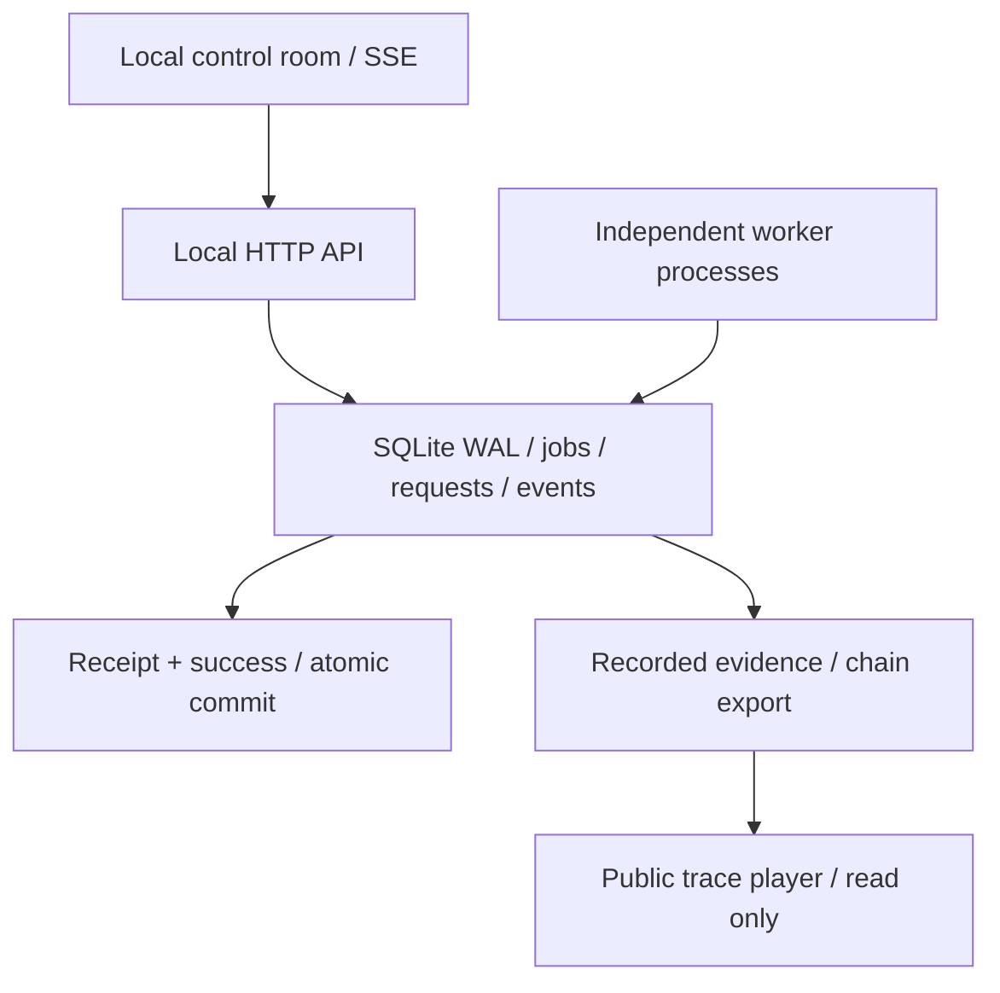

# Faultline

**Break the worker. Keep the promise.**

[](https://github.com/qiyuhuating/faultline-lab/actions/workflows/verify.yml)


Faultline 是一个可以亲手制造故障的任务执行实验室。真实 Worker 进程会崩溃、停止续租、重复尝试；任务保存在 SQLite 中。实验台展示谁拥有租约、谁提交结果、谁的旧 token 被拒绝，并逐条核对恢复是否正确。

**[交互式真实轨迹回放](https://qiyuhuating.github.io/faultline-lab/)** · [验收证据](docs/VERIFICATION.md) · [架构与取舍](docs/DESIGN.md) · [三分钟演示与简历材料](docs/PORTFOLIO.md) · [版本修复记录](docs/CHANGELOG.md)

`TypeScript strict` · `Node.js 24` · `SQLite WAL` · `Independent OS processes` · `SSE` · `Zero runtime dependencies`

## 30 秒启动

安装 **Node.js 24.15+（24.x）**，在项目目录运行：

```sh
npm start
```

打开 **http://127.0.0.1:8787**。不需要 npm install、数据库服务、云账号或 API Key。首次队列为空；点击实验卡片产生真实任务。Windows 可双击 `start.cmd`。

```sh
node src/server.mjs --port=8788 --workers=4 --db=data/my-lab.sqlite
```

Ctrl+C 停止，再次启动会保留任务、幂等记录和暂停状态。默认数据库位于本项目的 `data/`，不会引用其他项目的数据。

## 让事情真的出错

| 实验 | 实际故障 | 可核对的结果 |
| --- | --- | --- |
| Crash | 第一次领取后对 Worker 执行 SIGKILL | expired → 新 owner / 更大 token → 唯一收据 |
| Zombie worker | 独立进程故意停止续租，然后苏醒并尝试提交 | 新 Worker 已提交，旧 token 的真实写入被拒绝 |
| Retry | 前两次处理失败 | failed → failed → succeeded，指数退避、唯一收据 |
| Dedupe | 同一意图调用提交逻辑三次 | 三次调用，一个任务；另有独立 HTTP 并发测试 |
| Dead letter | 三次尝试全部失败 | 预算耗尽，无成功收据；显式重放进入新 generation |
| Lost response | 服务端写入落盘后主动切断响应连接 | 客户端通过持久化请求键确认原结果，不自动重发 POST |

每次实验都有独立编号、自动验收断言和可下载报告。点击 **追踪** 查看各次 attempt、owner、token、revision、generation 与真实处理结果。

公开页面是**真实记录的回放器**，不会模拟实时执行。记录由 `tools/record-traces.mjs` 调用本机 HTTP 服务并启动独立进程录制；浏览器重新校验事件链后才允许回放。当前公开轨迹保留 2026-09-30 的原始实验记录，后续版本未为部署重新录制。制造新故障请运行本地实验台。

## 工程重点

- **事务领取：** `BEGIN IMMEDIATE` 让多个 OS 进程安全竞争任务。
- **租约与 fencing：** 续租有期限，token 单调递增，取消与过期都会撤销旧提交资格。
- **持久化幂等：** 请求键与规范化内容指纹一起落盘；同键不同内容返回 409，重启后仍可查询原结果。
- **原子提交：** 内置结果收据与 succeeded 状态在同一事务中提交；唯一键限制每个任务每轮一张收据。
- **一致读取：** 单任务详情、实验报告、快照和链导出使用 SQLite 读事务，避免拼接不同数据库版本。
- **故障恢复：** SSE 游标续读、条件请求、读取退避、后台关闭连接；草稿及未确认请求键在当前标签页刷新后恢复。
- **独立模型：** 16 种命令随机组合，与不导入生产规则的模型逐步比对，保存种子和可复现轨迹。
- **只读诊断：** 核对成功状态、收据、尝试和事件保留区间；观察异常而不代替恢复或修复。
- **可信度边界：** 单机开发实验室；执行至少一次；外部副作用需要独立幂等协议；事件链检查一致性，不提供第三方真实性证明。

## 验证

运行核心故障测试不需要安装依赖。开发阶段安装锁定的编译器与类型定义，再执行静态检查和类型契约验收：

```sh
npm ci --ignore-scripts
npm run check
npm run test:types
npm run format:check
npm test
npm run test:model -- --seed=1001 --seeds=128 --steps=256
npm run verify:lab
node tools/benchmark.mjs --jobs=500
```

v1.2.3 修复损坏事件的解析异常可能泄漏私密内容的问题，诊断继续返回 FAIL 并保留只读语义；v1.2.2 已核对任务类型、标签、优先级与重试预算是否符合持久化定义。此前的 v1.2.1 已补充跨连接与事务回滚后的报告缓存、持久化语义损坏、报告身份/token 校验，以及响应体中途停滞后的界面恢复。核心测试在 Linux 和 Windows 运行；仍保留 12 条负向编译契约、32,768 次独立模型操作和七种真实 HTTP 故障场景。用例涵盖 240 任务 / 4 进程竞争、真实写锁与崩溃接管、僵尸 Worker 提交、响应丢失、父进程死亡、事务回滚和并发读取。完整数量、远程 CI 与失败后修复记录见 [VERIFICATION.md](docs/VERIFICATION.md)。

浏览器测试与运行时文件分离：

```sh
npm ci --prefix tests --ignore-scripts
cd tests
npx playwright install chromium
cd ..
node tests/browser.mjs
node tests/browser-network.mjs
node tests/showcase.mjs
```

`FAULTLINE_BROWSER=firefox` 或 `webkit` 可切换引擎；CI 会跑三个浏览器。运行项目不需要测试依赖。源码 ZIP 与独立测试 ZIP 解压到同一父目录后合并为 `faultline/`，即可运行完整测试。

重新录制与构建公开回放：

```sh
node tools/record-traces.mjs
node tools/build-showcase.mjs
```

每次录制重新执行真实故障；不要为了更新部署重新制造记录。公开页只部署 `showcase/`，不会暴露本地控制令牌、数据库或测试集。

## 检查当前数据库

在实验台点击 **检查一致性**，查看物理完整性、租约、尝试、收据、请求记录和事件链的同一快照。可手动刷新与下载报告；失败刷新保留上一份有效报告。命令行检查已有数据库：

```sh
npm run doctor -- data/faultline.sqlite --json
```

Doctor 不创建数据库、不恢复租约、不修改 schema。FAIL 返回退出码 1；WARN 明确保留警告。完整扫描有读取成本，因此不加入后台轮询。

`npm run verify:lab` 会在临时数据库中启动真实进程，输出独立验收目录并清理 Worker。源码包含这两个运维工具；随机模型、测试夹具与浏览器测试只在测试包中。完整策略见 [ADR 006](docs/adr/006-executable-reliability-and-diagnostics.md)。

## 架构

v1.1.0 将原先 24,679 字节的 Queue 拆成 5,125 字节的组合入口。后端全部进入严格 TypeScript；前端和共享验收算法仍是原生 ESM。运行依靠 Node 24 的原生类型擦除；发布验收独立执行 `tsc`，因为运行时擦除不会检查类型。详见 [ADR 005](docs/adr/005-typed-domain-and-service-boundaries.md)。数据库 schema 和 HTTP 路径保持 v1 兼容。




## 文件职责

| 文件或目录 | 负责什么 |
| --- | --- |
| `src/queue.ts` | 小型组合入口，共享连接并转发稳定 API；不包含 SQL 或业务状态规则 |
| `src/domain/` | 状态判别联合、租约/提交结果契约和持久化记录的生命周期检查 |
| `src/storage/sqlite-store.ts` | SQLite 连接、写事务、可复用读事务与错误回滚的唯一拥有者 |
| `src/storage/job-repository.ts` | 作业与 attempt/receipt 的持久化操作，不判断时钟、权限或重试策略 |
| `src/services/job-service.ts` | 提交、revision 冲突、取消/重放与暂停业务规则 |
| `src/services/lease-service.ts` | 领取、续租、过期、退避与 fenced 原子结果提交 |
| `src/services/experiment-service.ts` | 可复现实验编排，复用同一提交和幂等原语 |
| `src/services/event-ledger.ts` | 追加事件、事件分页、流式全链检查与一致性导出 |
| `src/domain/event-chain.ts` | 连续序号、链 hash 与保留前缀/持久化链尾的范围校验 |
| `src/services/diagnostics-service.ts` | 只读数据库语义检查，区分完整性失败、未知历史边界与恢复警告 |
| `src/services/request-store.ts` | 持久化请求指纹、幂等结果与未知写入查询 |
| `src/services/query-service.ts` | 一致快照、任务详情、指标、实验报告及有界缓存 |
| `src/services/worker-registry.ts` | Worker 注册、心跳及停止记录 |
| `src/services/retention-service.ts` | 分批保留清理、链锚点推进和报告缓存失效 |
| `src/*.mjs` | 旧路径兼容入口，转入唯一的 TypeScript 实现 |
| `src/schema.sql` | 数据库约束与任务、尝试、请求、事件和实验表 |
| `src/worker.ts` | 独立进程执行、心跳、真实崩溃与停止续租实验 |
| `src/server.ts` | 本机 HTTP 边界、请求解析、SSE 和 Worker 监督 |
| `src/validation.ts` | 输入契约、机器错误、规范化内容指纹 |
| `src/handlers.ts` | 真实文本摘要与有限数值汇总 |
| `public/app.mjs` | 实时控制台、增量渲染、草稿与未知写入结果恢复 |
| `public/proof.mjs` | 服务端和回放器共用的无副作用验收断言 |
| `public/evidence.mjs` | CLI 和浏览器共用的事件链校验算法 |
| `showcase/player.mjs` | 真实记录的逐帧回放、时间轴与客户端复核 |
| `showcase/traces.json` | 六次真实实验录制，包含来源环境及链校验数据 |
| `tools/record-traces.mjs` | 调用真实 HTTP / Worker 生成回放记录 |
| `tools/build-showcase.mjs` | 从公共源文件复制共享模块，避免手写两套断言 |
| `tools/benchmark.mjs` | 带环境、工作负载和一致性检查的本机微基准 |
| `tools/verify-evidence.mjs` | 离线复核导出的事件链 |
| `tools/doctor.mjs` | 原生只读连接上的数据库诊断，支持 JSON 与进程退出码 |
| `tools/verify-lab.mjs` | 隔离的真实 HTTP 故障验收、重启验证与失败报告保留 |
| `tests/model/oracle.mjs` | 独立的状态策略模型，不导入生产状态机或持久化实现 |
| `tests/model-runner.mjs` | 多种子模型批次、操作覆盖、轨迹 hash 与失败前缀复现 |
| `tools/check-architecture.mjs` | 编译器 AST 检查分层、运行时循环、事务拥有者和显式 any |
| `tests/types/` | 编译器必须拒绝的非法状态、命令与提交结果，随测试 ZIP 独立交付 |
| `tools/package.mjs` | 构建源码、测试与静态网页 ZIP，生成文件清单及校验和 |
| `tools/collect-ci.mjs` | 汇总完整 CI 批次、原始日志与摘要校验通过的工件 |
| `tests/resilience.test.mjs` | 真实写锁、页配额、读一致性与停机故障回归 |
| `tests/` | 核心、HTTP、多进程、三浏览器和回放器测试；独立交付 |
| `docs/` | API、设计、ADR、验收、面试追问和演示材料 |

## 范围

本机绑定 `127.0.0.1`。Host / Origin / control-token 保护是本机防护，不是用户身份认证。不要将控制台直接暴露到公网。内置处理器的结果可原子落盘；短信、付款、第三方 API 等任意外部操作不在本项目保证范围内。

保留策略默认 30 天，活跃任务不会被删除；任务上限 10,000、事件按批次裁剪。已验证 SQLite 写锁等待和页配额耗尽；物理磁盘拔出、完整文件系统耗尽、主机时钟大幅跳变与持续磁盘阻塞仍需目标环境验收。详细取舍见 [DESIGN.md](docs/DESIGN.md)。

MIT License。Faultline 使用独立源码、运行目录、数据库、仓库、发布流程与视觉系统。
