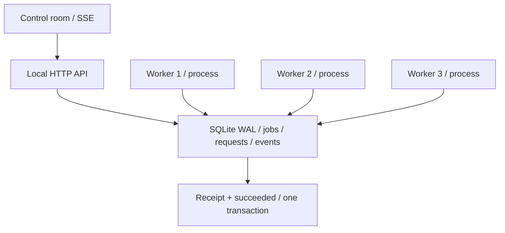

# Faultline

**Break the worker. Keep the promise.**


Faultline 是一个可以亲手制造故障的任务执行实验室。真实的独立 Worker 进程会被终止；任务留在 SQLite 中，租约过期后由其他 Worker 接管。每次领取、失败、恢复和提交都会留下可以导出的执行记录。

`Node.js 24` · `SQLite WAL` · `Multi-process workers` · `Server-Sent Events` · `Zero runtime dependencies`

## 30 秒启动

安装 **Node.js 24.15+（24.x）**，在项目目录运行：

```sh
npm start
```

打开 **http://127.0.0.1:8787**。不需要 npm install、数据库服务、云账号或 API Key。首次打开队列为空，点击实验卡片产生真实任务。

端口、数据库和 Worker 数量可以单独指定：

```sh
node src/server.mjs --port=8788 --workers=4 --db=data/my-lab.sqlite
```

使用 Ctrl+C 停止。再次启动会继续使用数据库中已有的任务、幂等记录与暂停状态。

## 在演示中，让事情真的出错

| 实验 | 故障 | 应观察到的证据 |
| --- | --- | --- |
| Retry | 前两次处理失败 | 三次尝试，退避重试，最终一张结果收据 |
| Crash | 第一次领取后对 Worker 执行 SIGKILL | 第一次尝试 expired，新 Worker 使用更大的 token，最终一张收据 |
| Dedupe | 同一个意图调用提交逻辑三次 | 三次调用，一个任务，两条 request.deduplicated 事件 |
| Dead letter | 三次尝试均失败 | 死信终态；显式清除故障重放后 generation 加一，旧历史保留 |

点击任务的 **追踪** 查看 Worker、token、revision、generation、每次尝试及真实的 SHA-256 或数值汇总结果。Dedupe 实验在一笔事务中重复调用提交逻辑；独立 HTTP 测试还验证了三个并行请求的去重。

## 工程重点

- **事务领取：** 多个独立进程通过 `BEGIN IMMEDIATE` 竞争同一队列，避免同时拥有同一个有效租约。
- **租约与 fencing：** 每次领取递增 token。过期租约、被取消任务和旧 Worker 的提交都被拒绝。
- **持久化幂等：** 请求键与规范化内容指纹一起落盘；同键不同内容返回 409，重启后仍有效。
- **有预算的重试：** 指数退避、确定性抖动、最大尝试次数及死信出口。
- **可核对的结果：** 内置处理器的结果收据与成功状态在同一事务中提交，唯一键限制每个 generation 一张收据。
- **可观察的恢复：** SSE 使用持久化事件游标断线续读；前端保留草稿，写入失败时提示结果未确认。
- **事件一致性校验：** 保留事件形成 SHA-256 哈希链，可导出并用 CLI 校验；保留策略删除前缀时保存链锚点。

## 验证与数据

本次实测 **40 项 Node 自动化测试通过**，包含 240 任务 / 4 进程竞争、真实 SIGKILL 接管、控制器重启、事务回滚、版本冲突、HTTP 防护和 SSE 续读。

500 个轻量摘要任务 / 4 Worker 的本机微基准：**714 ms** 完成，500 张收据，500 次尝试，事件链校验通过。这个结果只描述本次 Linux / Node 24.19.0 的本机环境，不能替代生产容量测试。

**浏览器验收状态：** 已提供 Chromium、Firefox、WebKit 测试脚本及 CI 工作流；当前环境没有浏览器二进制，因此本次未执行浏览器回归。不要把它描述成三浏览器已通过。完整证据与边界见 [验收报告](docs/VERIFICATION.md)。

```sh
npm run check
npm test
node tools/benchmark.mjs --jobs=500
```

如果使用分开的交付包，先将源码 ZIP 与测试 ZIP 解压到同一父目录，合并得到 `faultline/`，再运行 npm test。项目运行不依赖测试包。

浏览器回归需要另外安装测试依赖与浏览器：

```sh
npm install --prefix tests --ignore-scripts
cd tests
npx playwright install chromium
cd ..
node tests/browser.mjs
```

## 架构



## 关键文件

| 文件 | 职责 |
| --- | --- |
| `src/queue.mjs` | 事务、领取、租约、fencing、重试、重放、分页和保留策略 |
| `src/schema.sql` | 数据表、约束与队列索引 |
| `src/worker.mjs` | 独立进程循环、心跳、故障注入和处理器调用 |
| `src/server.mjs` | HTTP API、SSE、安全响应头与 Worker 生命周期 |
| `src/handlers.mjs` | 真正的文本摘要与有限数值序列汇总 |
| `src/validation.mjs` | 输入验证、请求规范化、指纹与机器可读错误 |
| `public/app.mjs` | 实验操作、服务端状态展示、草稿、详情及重连 |
| `public/styles.css` | Control room 的独立视觉系统与响应式布局 |
| `tools/benchmark.mjs` | 可复现的本机性能与完整性验证 |
| `tools/verify-evidence.mjs` | 离线核对导出的事件链 |
| `tools/retention.mjs` | 按策略清理历史，保留活跃任务 |
| `tests/` | 独立的领域、HTTP、真实进程及浏览器测试 |

## 边界

这是**单机、本机访问的可靠性实验室**。服务器绑定 127.0.0.1，控制令牌是跨站写入防护，不是账户认证。任务不会执行用户代码、Shell 或任意 URL。

执行语义是 **at-least-once**。单事务结果收据只覆盖内置数据库结果；邮件、付款、远程 HTTP 等外部副作用需要接收端幂等或其他业务协议。SQLite 同步接口与单写者会限制扩展能力；当前不宣称多机器调度、生产 HA 或不可伪造审计。

默认保留策略：终态任务与幂等记录 30 天；最近 50,000 条事件，定期分批清理；活跃任务保留，任务总数上限 10,000。见 [设计说明](docs/DESIGN.md)。

## 文档

- [设计与关键取舍](docs/DESIGN.md)
- [HTTP 契约](docs/API.md)
- [验收报告与证据](docs/VERIFICATION.md)
- [三分钟演示与简历措辞](docs/PORTFOLIO.md)
- [面试讲解与实践练习](docs/INTERVIEW.md)

MIT License. Built with AI-assisted development; implementation and verification evidence are included.
