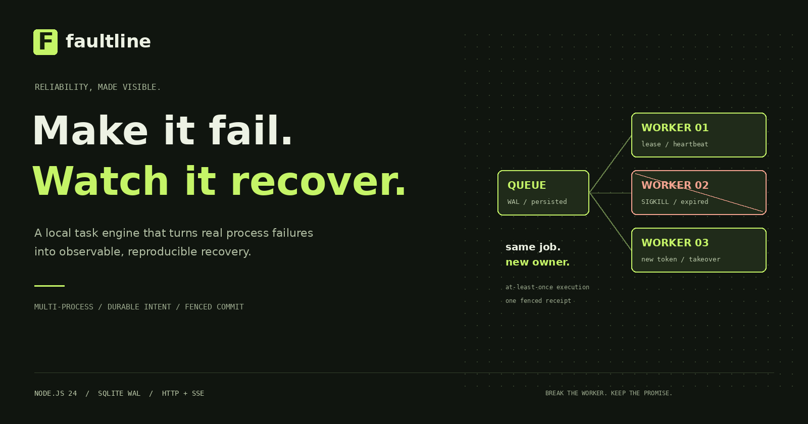
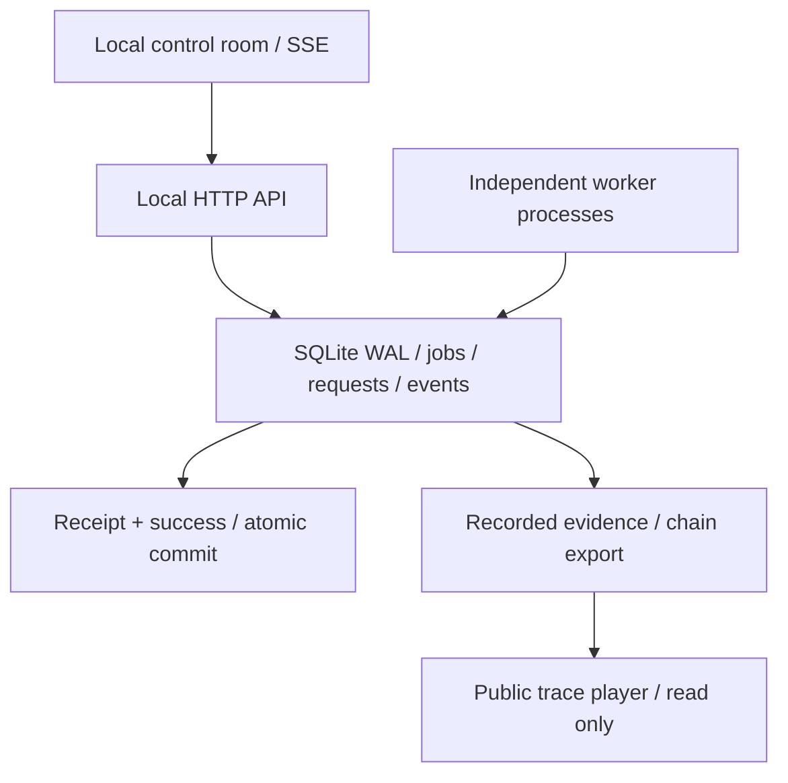

# Faultline

**Break the worker. Keep the promise.**

[](https://github.com/qiyuhuating/faultline-lab/actions/workflows/verify.yml)



Faultline 是一个可以亲手制造故障的任务执行实验室。真实 Worker 进程会崩溃、停止续租、重复尝试；任务保存在 SQLite 中。实验台展示谁拥有租约、谁提交结果、谁的旧 token 被拒绝，并逐条核对恢复是否正确。

**[交互式真实轨迹回放](https://qiyuhuating.github.io/faultline-lab/)** · [验收证据](docs/VERIFICATION.md) · [架构与取舍](docs/DESIGN.md) · [三分钟演示与简历材料](docs/PORTFOLIO.md)

`Node.js 24` · `SQLite WAL` · `Independent OS processes` · `SSE` · `Zero runtime dependencies`

## 30 秒启动

安装 **Node.js 24.15+（24.x）**，在项目目录运行：

```sh
npm start
```

打开 **http://127.0.0.1:8787**。不需要 npm install、数据库服务、云账号或 API Key。首次队列为空；点击实验卡片产生真实任务。Windows 可双击 `start.cmd`。

```sh
node src/server.mjs --port=8788 --workers=4 --db=data/my-lab.sqlite
```

Ctrl+C 停止，再次启动会保留任务、幂等记录和暂停状态。默认数据库位于本项目的 `data/`，不会引用其他项目的数据。

## 让事情真的出错

| 实验 | 实际故障 | 可核对的结果 |
| --- | --- | --- |
| Crash | 第一次领取后对 Worker 执行 SIGKILL | expired → 新 owner / 更大 token → 唯一收据 |
| Zombie worker | 独立进程故意停止续租，然后苏醒并尝试提交 | 新 Worker 已提交，旧 token 的真实写入被拒绝 |
| Retry | 前两次处理失败 | failed → failed → succeeded，指数退避、唯一收据 |
| Dedupe | 同一意图调用提交逻辑三次 | 三次调用，一个任务；另有独立 HTTP 并发测试 |
| Dead letter | 三次尝试全部失败 | 预算耗尽，无成功收据；显式重放进入新 generation |
| Lost response | 服务端写入落盘后主动切断响应连接 | 客户端通过持久化请求键确认原结果，不自动重发 POST |

每次实验都有独立编号、自动验收断言和可下载报告。点击 **追踪** 查看各次 attempt、owner、token、revision、generation 与真实处理结果。

公开页面是**真实记录的回放器**，不会模拟实时执行。记录由 `tools/record-traces.mjs` 调用本机 HTTP 服务并启动独立进程录制；浏览器重新校验事件链后才允许回放。制造新故障请运行本地实验台。

## 工程重点

- **事务领取：** `BEGIN IMMEDIATE` 让多个 OS 进程安全竞争任务。
- **租约与 fencing：** 续租有期限，token 单调递增，取消与过期都会撤销旧提交资格。
- **持久化幂等：** 请求键与规范化内容指纹一起落盘；同键不同内容返回 409，重启后仍可查询原结果。
- **原子提交：** 内置结果收据与 succeeded 状态在同一事务中提交；唯一键限制每个任务每轮一张收据。
- **一致读取：** 实验报告、快照和链导出使用 SQLite 读事务，避免拼接不同数据库版本。
- **故障恢复：** SSE 游标续读、条件请求、读取退避、后台关闭连接；草稿及未确认请求键在当前标签页刷新后恢复。
- **可信度边界：** 单机开发实验室；执行至少一次；外部副作用需要独立幂等协议；事件链检查一致性，不提供第三方真实性证明。

## 验证

```sh
npm run check
npm test
node tools/benchmark.mjs --jobs=500
```

核心用例涵盖 240 任务 / 4 进程竞争、实际 SIGKILL 接管、僵尸 Worker 提交、响应丢失、父进程死亡、数据库事务回滚和并发读取。验收结果、远程 CI 与失败后修复记录见 [VERIFICATION.md](docs/VERIFICATION.md)。

浏览器测试与运行时文件分离：

```sh
npm install --prefix tests --ignore-scripts
cd tests
npx playwright install chromium
cd ..
node tests/browser.mjs
node tests/showcase.mjs
```

`FAULTLINE_BROWSER=firefox` 或 `webkit` 可切换引擎；CI 会跑三个浏览器。运行项目不需要测试依赖。源码 ZIP 与独立测试 ZIP 解压到同一父目录后合并为 `faultline/`，即可运行完整测试。

重新录制与构建公开回放：

```sh
node tools/record-traces.mjs
node tools/build-showcase.mjs
```

每次录制重新执行真实故障；不要为了更新部署重新制造记录。公开页只部署 `showcase/`，不会暴露本地控制令牌、数据库或测试集。

## 架构



## 文件职责

| 文件或目录 | 负责什么 |
| --- | --- |
| `src/queue.mjs` | 事务、幂等、租约、状态流转、收据、读快照及保留策略 |
| `src/schema.sql` | 数据库约束与任务、尝试、请求、事件和实验表 |
| `src/worker.mjs` | 独立进程执行、心跳、真实崩溃与停止续租实验 |
| `src/server.mjs` | 本机 HTTP 边界、请求解析、SSE 和 Worker 监督 |
| `src/validation.mjs` | 输入契约、机器错误、规范化内容指纹 |
| `src/handlers.mjs` | 真实文本摘要与有限数值汇总 |
| `public/app.mjs` | 实时控制台、增量渲染、草稿与未知写入结果恢复 |
| `public/proof.mjs` | 服务端和回放器共用的无副作用验收断言 |
| `public/evidence.mjs` | CLI 和浏览器共用的事件链校验算法 |
| `showcase/player.mjs` | 真实记录的逐帧回放、时间轴与客户端复核 |
| `showcase/traces.json` | 六次真实实验录制，包含来源环境及链校验数据 |
| `tools/record-traces.mjs` | 调用真实 HTTP / Worker 生成回放记录 |
| `tools/build-showcase.mjs` | 从公共源文件复制共享模块，避免手写两套断言 |
| `tools/benchmark.mjs` | 带环境、工作负载和一致性检查的本机微基准 |
| `tools/verify-evidence.mjs` | 离线复核导出的事件链 |
| `tests/` | 核心、HTTP、多进程、三浏览器和回放器测试；独立交付 |
| `docs/` | API、设计、ADR、验收、面试追问和演示材料 |

## 范围

本机绑定 `127.0.0.1`。Host / Origin / control-token 保护是本机防护，不是用户身份认证。不要将控制台直接暴露到公网。内置处理器的结果可原子落盘；短信、付款、第三方 API 等任意外部操作不在本项目保证范围内。

保留策略默认 30 天，活跃任务不会被删除；任务上限 10,000、事件按批次裁剪。主机时钟大幅跳变、持续磁盘阻塞和磁盘耗尽不属于已完成的部署验收。详细取舍见 [DESIGN.md](docs/DESIGN.md)。

MIT License。Faultline 使用独立源码、运行目录、数据库、仓库、发布流程与视觉系统。
