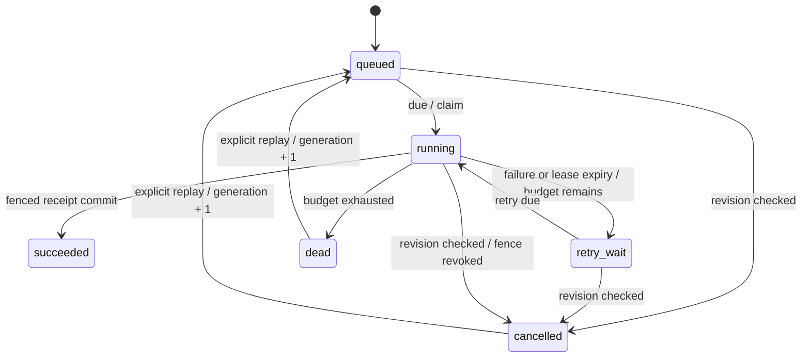

# Design notes

## 目标与独立范围

Faultline 是一个独立的新项目。它演示开发基础设施的失败恢复：任务调度、进程生命周期、数据库事务和结果提交。项目在自己的目录与数据文件中运行，不导入其他项目的代码、样式、配置或数据。

初版验收范围是可运行单机引擎、真实故障注入、可核对的数据库结果、可复现的测试与明确的语义边界。外部 HTTP 投递、用户租户、集群、AI 调用和复杂工作流不属于初版。

## 状态与所有权

`attempt` 是本轮尝试次数；`generation` 是显式重放轮次；`revision` 用于用户操作冲突；`lease_token` 在每次领取、取消、重放时递增。它们职责不同，不能混用。

领取在 SQLite `BEGIN IMMEDIATE` 写事务中完成。查找 due 任务、设置所有权、增加 token、插入 attempt、追加事件一起提交。所有 Worker 使用同一个本机数据库文件，SQLite 文件锁是此处的协调机制。

完成与失败检查当前状态、owner、token 和未过期 deadline。即使 sweeper 尚未运行，过期 Worker 也不能续约或提交。取消撤销所有权并增加 token，旧进程可能仍继续计算，但无法提交结果。

## 租约

默认租约 2,400 ms，心跳 400 ms，恢复扫描 200 ms。领取循环空闲等待 100 ms。Worker 被 SIGKILL 后无法执行 finally；服务器记录进程退出，然后等待数据库租约到期。新进程领取获得更大的 token。

这些值是实验室配置，不是适合所有生产负载的经验参数。GC、磁盘阻塞或 CPU 过载可能产生错误的租约过期；fencing 会保住数据库结果边界，但会增加重试。长任务应使用可中止计算、合理续约和接收端幂等。

所有时间由本机进程产生；客户端显示使用服务器时间加 performance.now 的经过时间。系统主机时钟跳变依然可能影响此单机租约模型。多主机系统需要重新设计时间与协调协议。

## 重试和重放

退避为 `min(6000, 500 * 2^(attempt-1))` ms，再乘 0.8–1.2 的抖动。抖动来自 jobId 和 attempt 的 SHA-256，便于复现，但不用于安全随机。

失败或租约过期均消耗一次尝试预算，最多 5 次。耗尽进入 dead。死信不会自动无限重试；显式重放增加 generation 并保留旧 attempts。界面上的重放按钮会明确清除实验故障。每个任务最多 20 次重放。

## 幂等边界

幂等键与 `{operation, normalized body}` 指纹及结果一起落盘，同键不同意图返回 409。记录保留 30 天，超过保留窗口不能再假定旧键仍具有去重效果。

结果收据唯一约束是 `(job_id, generation)`。收据插入和 succeeded 状态在同一事务内提交，触发器故障测试验证了插入失败时整个事务回滚。

**没有任意外部副作用的 exactly-once 承诺。** 处理器返回纯计算结果，结果写入当前事务。如果扩展付款、邮件或外部 API，需要目标系统的幂等键/去重或可补偿协议。

## 事件链

事件包含全局递增序号、任务 ID、类型、时间、规范化数据、前一个 hash 和当前 hash。链检查可发现保留记录的内容修改与内部缺口。前缀保留策略保存最后删除事件的 hash 作为锚点。

拥有数据库写权限的人可以重写整条链与锚点；导出文件也没有独立可信的签名。因此它是**一致性检查**，不是防管理员伪造的安全审计或第三方证明。

## 安全与产品约束

- 只绑定 127.0.0.1，拒绝未知 Host，减小 DNS rebinding 风险。
- POST 检查 Origin、Sec-Fetch-Site、控制令牌、JSON 类型和幂等键；不配置 CORS。
- bootstrap 提供本机控制令牌，它不替代身份认证；不应通过反向代理直接公开到互联网。
- 请求正文最多 32 KB，任务文本最多 12 KB；类型、整数字段和未知字段都验证。
- 仅运行两类内置纯计算处理器，没有任意 Shell、脚本或网络 URL 执行能力。
- UI 只使用 DOM textContent/text nodes；严格 CSP 禁用脚本与样式属性内联。
- 写请求不自动重试；不确定结果保留同意图幂等键，用户显式重试。

## 性能取舍

Node 的 SQLite 接口为同步调用。所有数据库事务短小，计算交给独立进程；数据库仍是单写者，繁重查询仍可能阻塞 API 事件循环。这种选择降低部署门槛并让一致性协议容易复现，不构成高吞吐集群实现。

任务列表最多 40 条，使用 seq keyset 分页。事件详情最多 100 条，尝试记录最多 21 个 generation × 5 次。页面按任务 ID 更新变化行，SSE 连接最多 12 条，慢客户端触发背压时断开重连。

保留任务上限 10,000；终态/请求记录默认 30 天；事件目标 50,000 条，服务器每十分钟分批清理。超过保留限可能暂时积累；`node tools/retention.mjs` 可执行完整清理。活跃任务不被删除。

事件导出当前上限 60,000 条；若自动保留尚未追上大量写入，应先执行 retention 再导出。超过截断范围时链尾校验不会报告通过。

## 下一步的依据

优先完成浏览器回归、故障时间参数化和异步数据库访问；在确有跨机调度需求时，再考虑 PostgreSQL 事务领取与真实认证。没有测量结果前，不以新增中间件替代已验证的语义。

参考：[Node 24 SQLite 文档](https://nodejs.org/download/release/latest-v24.x/docs/api/sqlite.html)、[SQLite WAL](https://sqlite.org/wal.html)、[SQLite Transactions](https://sqlite.org/lang_transaction.html)。Node 24 的 SQLite 模块仍标为 release candidate；本次固定使用 Node 24.19.0。
